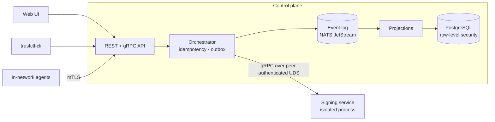

<!--
  TODO before going public:
  - set the real license + license badge once finalized
  (Repo/registry namespace is standardized on imfeelingtheagi/trustctl.)
-->

# trustctl

**The control plane for every credential that isn't a human.**

Discover, issue, deploy, rotate, revoke, and retire X.509 certificates, SSH host
and user certificates, secrets, API keys, tokens, and SPIFFE workload identities
— across hybrid infrastructure, fully self-hosted.

[](https://github.com/imfeelingtheagi/trustctl/actions/workflows/ci.yml)
[](https://github.com/imfeelingtheagi/trustctl/tags)
[](https://goreportcard.com/report/github.com/imfeelingtheagi/trustctl)


-lightgrey)

> **Status — active development.** Phase 1 is capability-complete and tested (see
> [Capabilities](#capabilities)) on the architectural bedrock below, with the
> custom architecture linter green in CI. `cmd/trustctl` now **assembles and serves
> the control plane** — it starts the event log, projections, orchestrator, and
> API in order, supervises the signing service as a separate child process (AN-4),
> answers real API requests, and shuts down gracefully — so `docker compose up`
> yields an evaluable control plane. It is pre-1.0 and under active hardening, but
> the runtime-assembly gap is closed.

---

## Why

Machine and workload identities now outnumber human ones by orders of magnitude,
and most teams manage them with a different tool for each kind: one thing for TLS
certificates, another for secrets, something else for SSH, and a closed,
SaaS-only suite for the enterprise features on top. The result is no single
inventory, no shared ownership model, no consistent rotation, and no one view of
blast radius when something leaks.

trustctl is one self-hosted control plane for *all* non-human credentials. It
treats them as a single graph of owners, issuers, identities, and the targets
they're deployed to — so discovery, lifecycle, policy, risk, and audit are the
same everywhere, and you run the whole thing on infrastructure you control.

## What it does

The lifecycle, for every credential type:

**discover → issue → deploy → rotate → revoke → retire**

- **Discover** what you already have: network and filesystem scans, SSH keys and
  trust, agentless cloud-certificate enumeration (AWS / Azure / GCP), a
  Cryptographic Bill of Materials (CBOM) with post-quantum posture, and
  Certificate Transparency monitoring for unexpected issuance.
- **Issue** through a built-in ACME server (including ARI) brokering to your CA,
  or a private CA hierarchy with OCSP/CRL revocation.
- **Deploy** renewed credentials to where they live, through capability-scoped
  connectors — load balancers and web servers, appliances, and cloud certificate
  stores. (The shipped connectors are trusted in-process code, scoped to the
  capabilities they declare; the WASM sandbox isolates *third-party* plugins —
  see [the plugin trust model](docs/security/threat-model.md).)
- **Rotate, revoke, retire** on a lifecycle state machine, with drift detection
  that notices when something changes a credential out from under you.
- **Understand** the whole estate: a credential graph (reachability and blast
  radius), composite risk scoring (what to rotate first), RBAC, SSO, and a signed
  audit trail.

## Capabilities

Phase 1 — built and tested. "Built and tested" means real library code with unit,
property, integration, and conformance tests. Some of it is **served end to end by
the running binary today** (inventory, lifecycle, real X.509 issuance, auth, audit,
observability, resilience, backup/DR, migrations); much of it — the CA
integrations, deployment connectors, discovery, graph/risk, and the broader
protocol surface — is **library-level and not yet wired into the served binary**.
[**Current limitations**](docs/limitations.md) is the authority on what runs end to
end at runtime versus what is library code.

| Area | What's there |
| --- | --- |
| Issuance | ACME server with ARI; private CA hierarchy with OCSP/CRL revocation; 9 CA integrations |
| Deployment | 10 connectors (web servers, load balancers, appliances, cloud cert stores) plus Kubernetes |
| Agent | Linux, macOS, and Windows; local key generation — private keys never leave the host |
| Discovery | network/filesystem, SSH keys & trust, agentless cloud certs, CBOM + PQC posture, CT monitoring |
| Posture | drift detection, composite risk scoring, the credential graph |
| Platform | RBAC, SSO (OIDC), append-only audit, multi-tenancy |
| Delivery | web UI with a first-run wizard, a REST API publishing its **OpenAPI 3.1** spec at `/api/v1/openapi.json`, a CLI at full API parity, reproducible & cosign-signed images with an SBOM |

## Built differently

trustctl is opinionated about architecture from the first commit, because these
properties are impossible to retrofit. Eight non-negotiables are enforced by a
custom `go/analysis` linter that fails the build on violation:

| | Principle |
| --- | --- |
| **AN-1** | Multi-tenancy at the storage layer — every row carries a tenant, isolated by PostgreSQL row-level security, not application code. |
| **AN-2** | Event-sourced — NATS JetStream is the source of truth; the relational read model and the audit trail are projections. |
| **AN-3** | All cryptography behind one boundary — a single package; nothing else imports `crypto/*`. |
| **AN-4** | The signing service is an isolated process — its own address space, reached over gRPC; no HTTP server, no SQL driver. |
| **AN-5** | Idempotency on every mutation — a retried issuance can't mint two certificates. |
| **AN-6** | Outbox for every external call — intent is written in the same transaction as the state change; a worker delivers it at least once. |
| **AN-7** | Bulkheads and backpressure — each subsystem has its own bounded pool; one slow connector can't starve the API. |
| **AN-8** | Memory safety for key material — secrets live in locked, zeroed `[]byte`, never `string`. |



## Try it

Requires Go 1.25+, Node 22+ (for the web UI), and Docker (for the evaluation
stack).

```bash
git clone https://github.com/imfeelingtheagi/trustctl
cd trustctl

make build    # control plane, signer, agent, and CLI
make web      # build the React UI into the binary's embed
make test     # unit + property + embedded-PostgreSQL/NATS integration tests
make lint     # gofmt, vet, the architecture linter, and actionlint
```

The evaluation stack brings up PostgreSQL, NATS JetStream, and the control-plane
binary together:

```bash
docker compose -f deploy/docker/docker-compose.yml up --build
```

The full first-certificate walkthrough — connect a CA, install an agent, issue a
cert — is in **[Getting started](docs/getting-started.md)**. See the status note
above for what runs end to end today.

## Documentation

- [Getting started](docs/getting-started.md) — first certificate, fast
- [Install](docs/install.md) and [Uninstall](docs/uninstall.md) — Linux, macOS, Windows, Docker, Kubernetes
- [Configuration](docs/configuration.md) — datastores, server, lifecycle, telemetry
- [CLI](docs/cli.md) — scripting and CI
- [Troubleshooting](docs/troubleshooting.md)
- Authoring guides: [connectors](docs/guides/connector-authoring.md) · [plugins](docs/guides/plugin-authoring.md)
- Design: [the signing service](docs/design/signing-service.md)

## Roadmap

Phase 1 (above) is complete. Phase 2 builds on it, in dependency order: an
issuance foundation (certificate profiles + a registration-authority model, and a
wider protocol surface — EST, SCEP); HSM/KMS backends; workload and AI-agent
identity (SPIFFE); incident response; code/artifact signing; and a
post-quantum-migration layer built on the Phase 1 CBOM.

## Privacy

trustctl runs entirely on infrastructure you control. Usage
[telemetry](docs/telemetry.md) is **opt-in and off by default**; when enabled it
sends only coarse, anonymized, non-PII data, and never any credential content.

## Security

If you find a security issue, please report it privately rather than opening a
public issue — see **[SECURITY.md](SECURITY.md)** for the disclosure process,
supported versions, and contact. The product threat model is in
[docs/security/threat-model.md](docs/security/threat-model.md), and the
security-critical signing service has its own
[design & threat model](docs/design/signing-service.md).

## Contributing

trustctl is built sprint by sprint with a tests-first discipline and the
architecture linter as a hard gate — `make lint test` must be green, and the
non-negotiables above are not optional. Start with the authoring guides for
[connectors](docs/guides/connector-authoring.md) and
[plugins](docs/guides/plugin-authoring.md). Fuller contribution guidelines are on
the way.

## License

trustctl is **source-available, but not open-source**: the full source is published
to read and build, but no open-source (OSI-approved) license has been granted. **The
license is undecided** — no license file is published yet; the specific instrument is
still being chosen and will be added here before any public release, and until a
license is published, **all rights reserved**. Nothing is feature-gated today; revenue
is intended to come from commercial/enterprise and MSP licensing, support, and a
managed offering, not from withholding the platform's capabilities.
