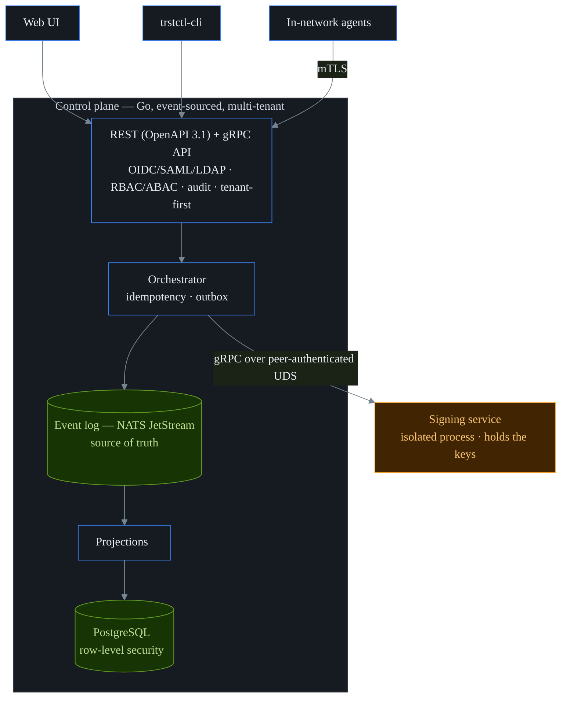

<!--
  Pre-public checklist (CODE-101):
  - set the real license + license badge once finalized
  (GitHub repo is github.com/ctlplne/trstctl — the canonical origin. Container
   images are still pushed under ghcr.io/ctlplne/trstctl; reconcile the
   registry namespace to ctlplne before going public.)
-->

```
   __            __       __  __
  / /___________/ /______/ /_/ /
 / __/ ___/ ___/ __/ ___/ __/ /
/ /_/ /  (__  ) /_/ /__/ /_/ /
\__/_/  /____/\__/\___/\__/_/

the keys to your infrastructure,
  kept in your infrastructure
```

<p align="center">Self-hosted control plane for every credential that <em>isn't</em> a human —<br>
discover, issue, deploy, rotate, revoke, and retire X.509 certificates, SSH certs, secrets,<br>
API keys, and SPIFFE workload identities. Private keys stay in an isolated process; you host it all.</p>

<p align="center">
<a href="https://github.com/ctlplne/trstctl/actions/workflows/ci.yml"></a>
<a href="https://github.com/ctlplne/trstctl/tags"></a>
<a href="https://goreportcard.com/report/github.com/ctlplne/trstctl"></a>


</p>

<p align="center">
<a href="#the-60-second-version">60-second version</a> ·
<a href="#why-trstctl">Why</a> ·
<a href="#what-it-answers">What it answers</a> ·
<a href="#capabilities">Capabilities</a> ·
<a href="#how-its-built">How it's built</a> ·
<a href="#try-it">Try it</a> ·
<a href="#documentation">Docs</a> ·
<a href="#license">License</a>
</p>

> **New here?** Start with **[Getting started](docs/getting-started.md)** (control
> plane up and your first certificate in minutes), then follow the **journey that
> matches your goal** — [issue your first certificate](docs/journeys/first-certificate.md),
> [automate TLS across your fleet](docs/journeys/automate-fleet-tls.md), [give
> Kubernetes workloads an identity](docs/journeys/kubernetes-workload-identity.md),
> [migrate from your existing CA](docs/journeys/migrate-from-existing-ca.md), or
> [respond to a compromise](docs/journeys/respond-to-compromise.md) (12 end-to-end,
> plain-language walkthroughs in all, each chaining the features you need). Prefer the
> reference? Browse the **[feature index](docs/features.md)** (all 79 capabilities,
> each with a deep-dive page) and the **[glossary](docs/glossary.md)**. The docs are
> written so a complete beginner and a domain expert both get value.

> **Status — active development.** A core slice is **served end to end by the running
> binary today** (certificate inventory, real X.509 issuance, the credential graph,
> risk scoring, OIDC/SAML/LDAP login, SCIM provisioning, RBAC plus ABAC authorization,
> the hash-chained audit log, observability, resilience,
> backup/DR, migrations). Much of the broader surface is **library-complete and tested
> but not yet wired into the served binary.** Each feature page states its own status,
> and **[Current limitations](docs/limitations.md) is the single authority** on what
> runs end to end versus what is library code. trstctl is **source-available, not
> open-source**: Community self-host carries the production grant in `LICENSE`,
> while Enterprise and Provider features require an offline signed license
> ([details](#license)).

---

## The 60-second version

Imagine a large building. Every door has a lock, and every person, robot, and
delivery cart needs the right key — keys that should expire, be re-cut on schedule,
and be revoked the moment one is lost. Now imagine nobody keeps a master register of
the locks and keys. That's machine-credential management at most companies today.

**trstctl is the master key register *and* the locksmith *and* the courier.** It
walks the building to find every lock and key (discovery), cuts and stamps new keys
(issuance), drives them to the right doors (deployment), re-cuts them before they
wear out (rotation), cancels lost ones (revocation), and keeps a tamper-proof log of
everything (audit) — for the machine world, where the "keys" are
[certificates](docs/glossary.md), SSH certs, [secrets](docs/glossary.md), tokens, and
workload identities.

For experts: it's an **event-sourced, multi-tenant control plane** for the full
**non-human-identity (NHI)** lifecycle — X.509, SSH, secrets, and
[SPIFFE](docs/glossary.md) — with private-key operations isolated in their own process
and all cryptography behind a single, swappable boundary. Skip to
[How it's built](#how-its-built).

## Why trstctl

Machine and workload identities now outnumber human ones by orders of magnitude, and
most teams manage them with a *different* tool for each kind: one product for TLS
certificates, another for secrets, something else for SSH, and a closed, SaaS-only
suite for the enterprise features on top. The result is no single inventory, no
shared ownership model, no consistent rotation — and, worst of all, no one view of
**blast radius** (what else is exposed) when a credential leaks. You find out at
2 a.m., a certificate has expired on a server nobody remembered, and the outage is
already happening.

Three choices set trstctl apart:

- **It stays yours.** Self-hosted on infrastructure you control; usage
  [telemetry](docs/telemetry.md) is opt-in, off by default, and never includes
  credential content. No credential data ships to a vendor cloud.
- **It's one model for everything.** Every non-human credential is a node in a single
  **graph** of owners, issuers, identities, and the targets they're deployed to — so
  discovery, lifecycle, policy, risk, and audit work the same way for a TLS cert, an
  SSH key, and a database password.
- **It's multi-tenant to the core.** Every row carries a tenant and is isolated by the
  database itself (not by application code), so one deployment safely serves many
  hard-isolated teams or customers. A single-org install is just the one-tenant case —
  no separate code path to drift out of sync.

## What it answers

trstctl is organized around the questions operators actually ask:

- *"What certificates, keys, and secrets do we even have — and which expire this
  week?"* → [discovery & inventory](docs/features/discovery-and-inventory.md) +
  [lifecycle](docs/features/lifecycle-and-pqc.md).
- *"If this key leaks, what else is exposed?"* → the credential graph's **blast
  radius** ([graph, query & AI](docs/features/graph-query-ai.md)).
- *"What should we rotate first?"* → composite **risk scoring**
  ([observability & risk](docs/features/observability-and-risk.md)).
- *"Who is allowed to issue — and can the requester quietly self-issue, or issue prod
  outside a change window?"* → RBAC + ABAC + the registration-authority split
  ([policy & governance](docs/features/policy-and-governance.md)).
- *"Where are we still using weak or quantum-vulnerable crypto?"* → the **CBOM**
  (Cryptographic Bill of Materials) ([observability & risk](docs/features/observability-and-risk.md)).
- *"Did someone get a certificate in our name that we didn't request?"* → **Certificate
  Transparency** monitoring ([discovery & inventory](docs/features/discovery-and-inventory.md)).

Or ask the built-in assistant in plain English — it answers with **cited evidence**,
grounded in real data and scoped to exactly what the caller may see.

## Who it's for

- **Platform & security teams** drowning in certificates, keys, and secrets spread
  across a half-dozen disconnected tools who want one inventory they actually own.
- **Regulated & sovereignty-conscious orgs** (finance, healthcare, public sector,
  critical infrastructure) that need credential automation but cannot send anything to
  a third-party cloud.
- **MSPs & multi-team orgs** — self-host once, serve many hard-isolated tenants from
  one control plane.

## What it does

The same lifecycle, for every credential type:

> **discover → issue → deploy → rotate → revoke → retire**

- **Discover** what you already have — scans of the network and filesystem, SSH keys
  and trust, agentless cloud-certificate enumeration straight from AWS/Azure/GCP APIs,
  a CBOM with post-quantum posture, and Certificate Transparency monitoring for
  unexpected issuance.
- **Issue** certificates automatically — a built-in **ACME** server (the protocol that
  auto-renews certs with no human in the loop), your own private **CA** (Certificate
  Authority) hierarchy gated by an m-of-n key ceremony, and the older enrollment
  protocols existing fleets already speak (EST, SCEP, CMP).
- **Deploy** renewed credentials to where they live, through capability-scoped
  connectors — web servers, load balancers, network appliances, and cloud certificate
  stores. (The shipped connectors are trusted, in-process code scoped to the
  capabilities they declare; the WASM sandbox isolates *third-party* plugins — see
  [the plugin trust model](docs/security/threat-model.md).)
- **Give workloads an identity** without planting secrets in them — the SPIFFE Workload
  API plus [attestation](docs/glossary.md) (cryptographic proof of *what and where* a
  workload is), including a purpose-built broker for AI agents.
- **Manage secrets** end to end — a versioned, envelope-encrypted store, dynamic
  secrets (created on demand and auto-revoked), encryption-as-a-service, and rotation.
- **Understand & respond** — a credential graph (reachability and blast radius),
  composite risk scoring, drift detection, and incident workflows (compromise
  remediation, just-in-time access, break-glass).

**The full catalog — all 79 capabilities, each mapped to its primary docs page — is the
[feature index](docs/features.md).**

## Capabilities

"Built and tested" means real library code with unit, property, integration, and
conformance tests. A core slice is **served end to end today**; much of the broader
surface is **library-complete but not yet wired into the served binary** —
[Current limitations](docs/limitations.md) is the authority on which is which. Every
number below is grounded in the repository.

| Area | What's there |
|---|---|
| **Issuance** | ACME (+ ARI), private CA hierarchy (m-of-n ceremony, OCSP/CRL), certificate profiles + RA separation, **14** CA integrations |
| **Enrollment** | EST, SCEP, CMP servers; an embedded/IoT C client; Intune/MDM challenge gating |
| **Workload identity** | SPIFFE Workload API (X.509 + JWT SVIDs), **6** cloud/hardware attesters, ephemeral issuance, an AI-agent broker |
| **SSH** | SSH certificate authority + KRL, additive trust agent (validate → reload → health-check → rollback), attestation-gated user certs |
| **Secrets** | envelope-encrypted store, **7** dynamic-secret backends, transit + KMIP, PKI-as-a-secrets-engine, rotation, secret sync (**7** targets) |
| **Deployment** | **24** production connectors (web servers, load balancers, appliances, mail proxies, databases, messaging/search targets, cloud cert stores), an example connector harness, Kubernetes agent/Operator, and cert-manager `Issuer`/`ClusterIssuer` integration |
| **Discovery & posture** | network/filesystem, SSH, agentless cloud certs (AWS/Azure/GCP), CBOM + PQC posture, CT monitoring, drift, risk scoring, the credential graph |
| **Key protection** | **6** HSM/KMS backends (PKCS#11, TPM 2.0, YubiHSM 2, AWS/Azure/GCP KMS), the isolated signer |
| **Crypto-agility** | classical + post-quantum (ML-DSA, ML-KEM, SLH-DSA, hybrid) behind one boundary, plus a PQC-migration orchestrator |
| **Platform** | REST API (OpenAPI 3.1), CLI at full parity, web UI with a first-run wizard, OIDC/SAML/LDAP sign-on, SCIM 2.0 provisioning, RBAC + ABAC, append-only audit, multi-tenancy |
| **Supply chain** | reproducible builds, cosign-signed images, and an SBOM |

## How it's built

trstctl is opinionated about architecture from the very first commit, because the
properties below are impossible to bolt on later. Eight **non-negotiables** are
enforced by a custom `go/analysis` linter that *fails the build* on violation — they
aren't guidelines, they're load-bearing walls. Each is in plain terms; the deep
mechanism lives in the linked docs.

| | Principle (in plain terms) |
|---|---|
| **AN-1** | **Tenants can't see each other — enforced by the database.** Every row carries a tenant ID, and PostgreSQL [row-level security](docs/glossary.md) blocks cross-tenant reads even if the application code has a bug. |
| **AN-2** | **The truth is an append-only log.** State changes are events in [NATS JetStream](docs/glossary.md); the regular tables and the audit trail are *projections* rebuilt from that log — nothing is silently overwritten, and the system can be rebuilt after a disaster. |
| **AN-3** | **All cryptography lives behind one door.** A single package; nothing else may import `crypto/*`. Adding an algorithm or an HSM is a one-package change — which is how post-quantum support slots in. |
| **AN-4** | **The signing service is a separate, sacred process.** Private keys live in their own address space, reached over gRPC on a peer-authenticated Unix socket — no HTTP server, no SQL driver. If it's compromised, the company is over, so it's treated that way. |
| **AN-5** | **Idempotency on every change.** Mutating APIs require an `Idempotency-Key`, and the Compose E2E gate owns the identity-transition issuance retry proof; until CORRECT closes that served-stack receipt, this path is a known AN-5 blocker rather than a blanket "retries never mint twice" claim. |
| **AN-6** | **An outbox for every external call.** The intent to call out (a CA, a webhook) is written in the *same database transaction* as the state change, and a worker delivers it at least once — so calls are never lost on a crash. |
| **AN-7** | **Bulkheads and backpressure.** Each subsystem has its own bounded worker pool; one slow connector or a discovery storm can never starve the API. |
| **AN-8** | **Memory safety for keys.** Secret material lives in locked, zeroed `[]byte`, never a Go `string` (which the garbage collector can copy freely). A key lives in RAM for milliseconds, not indefinitely. |



Five binaries make this real: `trstctl` (the control plane, which supervises the
signer as a child process), `trstctl-signer` (the isolated key-holder),
`trstctl-agent` (the in-network worker), `trstctl-operator`, and `trstctl-cli`.
Under the hood: **~1401 Go files across the internal subsystem packages**, with
property, differential, fuzz, and real-PostgreSQL/NATS integration tests, plus the
architecture linter in CI.

## Try it

Requires Go 1.26.4+, Node 22+ (for the web UI), and Docker (for the evaluation stack).

```bash
git clone https://github.com/ctlplne/trstctl
cd trstctl

make build    # control plane, signer, agent, operator, and CLI -> ./bin
make web      # build the React UI into the binary's embed
make test     # unit + property + embedded-PostgreSQL/NATS integration tests
make lint     # full lint: gofmt, vet, architecture, golangci-lint, actionlint
make lint-partial # explicit local subset when optional lint tools are absent
```

For a pre-populated click-through demo, use the demo stack. It starts local SSO,
PostgreSQL, NATS JetStream, LocalStack KMS, the isolated signer, and a seed job
that creates owners, certificates, secrets, transit keys, managed keys, and API
tokens through served APIs.

```bash
docker compose -f deploy/demo/docker-compose.yml up --build
```

Open <https://localhost:9443>, accept the local TLS certificate, and click **Sign
in with SSO**. The demo signs you in as `demo-admin@trstctl.local`.

For a blank evaluation/control-plane stack — PostgreSQL, NATS JetStream, and the
control plane — use the operational eval Compose file. Compose runs explicit
PostgreSQL and NATS service containers, which is the recommended eval path on
laptops and CI because it uses the same external-datastore wiring as production.

```bash
docker compose -f deploy/docker/docker-compose.yml up --build
```

If you run the `trstctl` binary directly instead, its bundled eval mode supervises
single-node PostgreSQL and embedded NATS without requiring local Postgres/NATS
services. That path still downloads the pinned PostgreSQL runtime once on first
use, verifies it against `deploy/supply-chain/embedded-postgres.json`, and fails
closed on an unsupported or unpinned host archive. The committed runtime pins
currently cover `linux-amd64`, `linux-arm64v8`, and `darwin-arm64v8`.

The control plane is serving about two minutes later, and issuance itself is a
sub-second operation — the end-to-end integration test mints a certificate into
inventory in **tens of milliseconds** (`TestAssembledServerIssuesCertIntoInventory`,
measured ~20 ms). The full first-certificate walkthrough — connect a CA, install an
agent, issue a cert — is in **[Getting started](docs/getting-started.md)**. Script it
through the REST API, which publishes its **OpenAPI 3.1** spec at
`/api/v1/openapi.json`, or the [CLI](docs/cli.md) at full API parity.

## What trstctl is not

trstctl is honest about its edges by design:

- **It manages machines, not people.** It is *not* a human IAM/SSO product for your
  employees' accounts — it uses OIDC, SAML, or LDAP / Active Directory to log
  *operators* in, and complements your human identity provider rather than replacing it.
- **It is self-hosted, not a SaaS.** Nothing phones home; you run it on your own
  infrastructure.
- **Its AI is grounded and read-only.** The assistant answers from cited evidence and
  never acts on its own; issuance, deployment, and remediation are gated by policy and,
  where configured, human approval.
- **It is precise about its own maturity.** A core slice is served end to end; the rest
  is library-complete and tested, with the gaps named in
  [Current limitations](docs/limitations.md) — never glossed over.

## Repository layout

```
cmd/        # binaries: trstctl (control plane), trstctl-signer (isolated key-holder),
            #           trstctl-agent (in-network worker), trstctl-operator, trstctl-cli
internal/   # subsystem packages: crypto (the one crypto boundary), signing, events,
            #   projections, store, orchestrator, api, ca, protocols/*, secrets..., graph, query, ...
plugins/    # WASM plugin category roots — ca/ and connectors/
tools/      # trstctllint — the architecture linter that enforces AN-1..AN-8
web/        # React 18 + Vite + shadcn/ui UI, embedded into the control-plane binary
deploy/     # docker (compose), helm chart, kubernetes, operator, observability,
            #   supply-chain, windows
clients/    # the embedded / IoT enrollment client (POSIX C)
docs/       # the documentation site (MkDocs) + the reality tests that keep docs honest
test/       # integration harness
scripts/    # developer & release scripts
```

## Documentation

| Topic | Doc |
|---|---|
| **Journeys** — end-to-end walkthroughs by goal (**start here**) | [first certificate](docs/journeys/first-certificate.md) · [automate fleet TLS](docs/journeys/automate-fleet-tls.md) · [Kubernetes identity](docs/journeys/kubernetes-workload-identity.md) · [enroll devices](docs/journeys/enroll-devices.md) · [migrate a CA](docs/journeys/migrate-from-existing-ca.md) · [onboard a team](docs/journeys/onboard-a-team.md) · [manage secrets](docs/journeys/manage-secrets.md) · [SSH at scale](docs/journeys/ssh-at-scale.md) · [respond to compromise](docs/journeys/respond-to-compromise.md) · [run in production](docs/journeys/run-in-production.md) · [build on the API](docs/journeys/build-on-the-api.md) · [crypto-agility & PQC](docs/journeys/crypto-agility-pqc.md) |
| **All 79 features** (each with a deep-dive page) | [`docs/features.md`](docs/features.md) |
| **Glossary** (every term, zero-knowledge friendly) | [`docs/glossary.md`](docs/glossary.md) |
| Getting started (first certificate, fast) | [`docs/getting-started.md`](docs/getting-started.md) |
| Install / Uninstall (Linux, macOS, Windows, Docker, K8s) | [`docs/install.md`](docs/install.md) · [`docs/uninstall.md`](docs/uninstall.md) |
| Configuration (datastores, server, lifecycle, telemetry) | [`docs/configuration.md`](docs/configuration.md) |
| CLI (scripting & CI) | [`docs/cli.md`](docs/cli.md) |
| What runs end to end vs. library code | [`docs/limitations.md`](docs/limitations.md) |
| Troubleshooting | [`docs/troubleshooting.md`](docs/troubleshooting.md) |
| Authoring guides | [connectors](docs/guides/connector-authoring.md) · [plugins](docs/guides/plugin-authoring.md) · [profiles](docs/guides/profile-authoring.md) · [EST](docs/guides/est-enrollment.md) |
| Design & security | [signing service](docs/design/signing-service.md) · [threat model](docs/security/threat-model.md) |
| Release history / changelog | [`CHANGELOG.md`](CHANGELOG.md) |
| Vulnerability disclosure | [`SECURITY.md`](SECURITY.md) |

## Roadmap

The honest axis isn't "phase 1 vs. phase 2" — most of the platform is already built
and tested. What remains:

- **Close the remaining named residuals** — automatic ACME order-time DNS-01
  publish/cleanup, React console cursor pagination and list virtualization, Terraform
  Cloud/OpenTofu and arbitrary webhook secret-sync targets, Vault KV outbound sync
  beyond discovery-only core, and KMIP appliance profiles/wrapping (tracked in
  [Current limitations](docs/limitations.md)).
- **Plugin marketplace maturity** for third-party CAs and connectors, on the existing
  WASM capability host.

## Security

If you find a security issue, please report it privately rather than opening a public
issue — see **[SECURITY.md](SECURITY.md)** for the disclosure process, supported
versions, and contact. Our triage, patch SLA, and advisory process are documented in
[docs/security/vulnerability-management.md](docs/security/vulnerability-management.md).
The product threat model is in
[docs/security/threat-model.md](docs/security/threat-model.md), and the
security-critical signing service has its own
[design & threat model](docs/design/signing-service.md).

## Contributing

trstctl is built sprint by sprint with a tests-first discipline and the architecture
linter as a hard gate. `make lint test` must be green; `make lint-partial` is only
for fast local feedback when optional lint tools are absent. The non-negotiables above
are not optional. Start with the authoring guides for
[connectors](docs/guides/connector-authoring.md) and
[plugins](docs/guides/plugin-authoring.md). Fuller contribution guidelines are on the
way.

## License

**Source-available — not open-source.** The full source is published to read,
audit, modify, build, and self-host. The Community core carries a production self-host
grant in [LICENSE](LICENSE), with attribution and contribution terms in
[NOTICE](NOTICE). This is not an OSI-approved open-source license. Commercial
Enterprise and Provider features are activated by an offline signed license and
live behind the `ee/` boundary; multi-tenancy, the event spine, the crypto
boundary, audit/export rights, and the license verifier stay in core.
